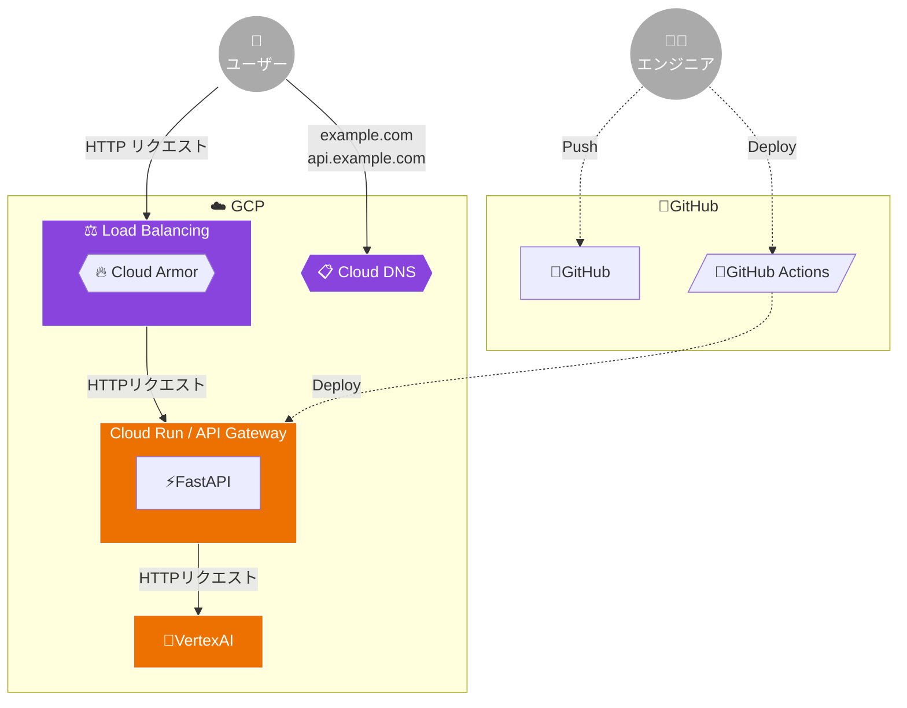

# 🛠️ システムアーキテクチャ
## ☁️ GCP

```mermaid
graph TD;
    User((👦 <br/>ユーザー)) -->|example.com <br/>api.example.com| DNS
    User -->|HTTP リクエスト| LB

    subgraph Cloud [☁️ GCP]
        DNS{{📋 Cloud DNS}}

        subgraph LB [⚖️ Load Balancing]
            %% Web Application Firewall
            WAF{{🔥 Cloud Armor}}
        end
        subgraph APIGateway [Cloud Run / API Gateway]
            Backend[⚡FastAPI]
        end

        LB --> |HTTPリクエスト|APIGateway
        APIGateway --> |HTTPリクエスト|VertexAI[🧠VertexAI]
    end
    
    subgraph GitHub [🐙GitHub]
        Repository[🐙GitHub]
        CICD[/🚀GitHub Actions/]
    end

    CICD -.-> |Deploy|APIGateway
    Engineer((🧑‍💻 <br/> エンジニア)) -.-> |Push|Repository
    Engineer((🧑‍💻 <br/> エンジニア)) -.-> |Deploy|CICD

%%---スタイル設定
%% 外部要素
classDef External fill:#aaa,color:#fff,stroke:#fff
%% DB 関連
classDef DataBase fill:#0e3feb,color:#fff,stroke:#fff
%% Network 関連
classDef Network fill:#84d,color:#fff,stroke:#fff
%% Compute 関連
classDef Compute fill:#ed7100,color:#fff,stroke:#fff
%% Storage 関連
classDef Storage fill:#0e4503,color:#fff,stroke:#fff
%% Security 関連
classDef Security fill:#d6242d,color:#fff,stroke:#fff
%% アプリケーション統合 関連
classDef Integration fill:#c41f5d,color:#fff,stroke:#fff

class User,Engineer External
class DNS,LB Network
class APIGateway,VertexAI Compute
```
